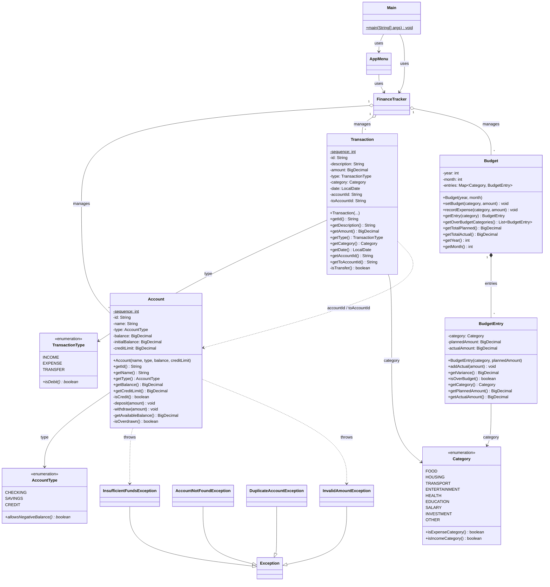

# Finance Tracker — Notes

## UML Class Diagram



## Package Layout

```
com.learn.finance
├── app          → Main
├── ui           → AppMenu
├── service      → FinanceTracker
├── model        → Account, Transaction, Budget, BudgetEntry
├── enums        → AccountType, TransactionType, Category
└── exception    → AccountNotFoundException, DuplicateAccountException,
                   InsufficientFundsException, InvalidAmountException
```

## Relationship Legend

| Symbol | Meaning |
|--------|---------|
| `-->`  | association / dependency |
| `o--`  | aggregation (has-a, shared lifetime) |
| `*--`  | composition (has-a, owned lifetime) |
| `--\|>` | inheritance |
| `..>`  | dependency (uses / throws) |
